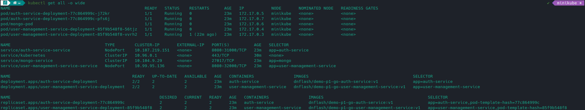
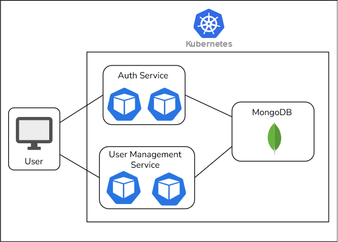

# demo-p1-microservices

This is a demo microservices project.

The service apps are written in Go and can be deployed using Kubernetes.

There are two services in this project:
- [Auth Service](https://github.com/dnflash/demo-p1-go-auth-service)
- [User Management Service](https://github.com/dnflash/demo-p1-go-user-management-service)

These services will need to connect to MongoDB. MongoDB image with initialized data is provided for demo.

### Deployment

```sh
kubectl apply -f ./kubernetes/
```
This will deploy:
- Auth Service with 2 replicas
- User Management Service with 2 replicas
- MongoDB Service with 1 pod

This is the output from `kubectl get all -o wide`:

 
### API Docs / Swagger

Swagger UI is available at:
- Auth Service: `<nodeIP>:31000/docs/swagger` [(Preview)](https://petstore.swagger.io/?url=https://raw.githubusercontent.com/dnflash/demo-p1-go-auth-service/main/docs/swagger.yaml)
- User Management Service: `<nodeIP>:32000/docs/swagger` [(Preview)](https://petstore.swagger.io/?url=https://raw.githubusercontent.com/dnflash/demo-p1-go-user-management-service/main/docs/swagger.yaml)
 
### Demo

1. Access Auth Service Swagger UI at `<nodeIP>:31000/docs/swagger` to login and get access token.
    - Admin Account
    ```
    "username": "admin"
    "password": "password"
    ```
    - Regular User Account
    ```
    "username": "user1"
    "password": "password"
    ```
2. Access User Management Service Swagger UI at `<nodeIP>:32000/docs/swagger` and authorize by clicking the authorize button and providing the access token with `Bearer` prefix (e.g. `Bearer <access_token>`) to access the available APIs.

### Diagram


